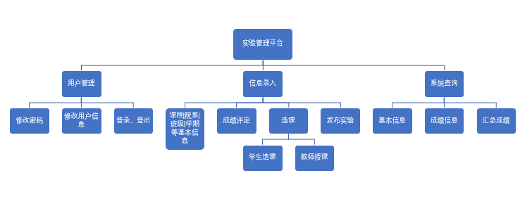
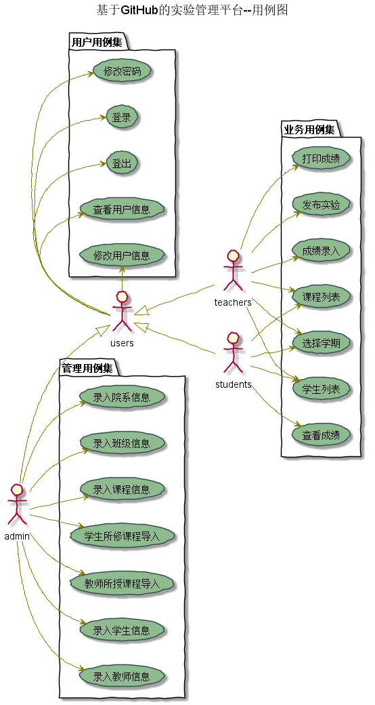
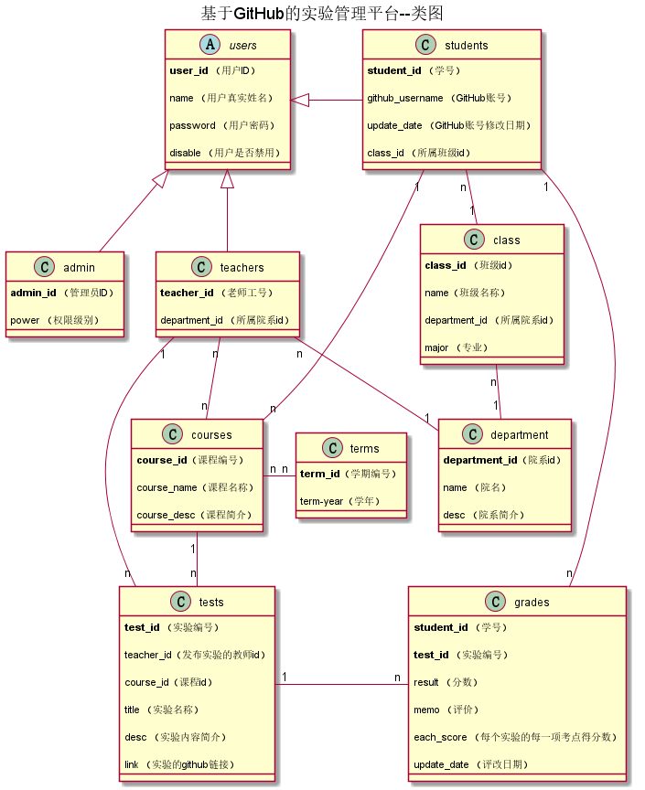

# 实验6：基于GitHub的实验管理平台的分析与设计
|学号|班级|姓名|照片|
|:-------:|:-------------: | :----------:|:---:|
|201510414108|软件(本)15-1|郭昆进||

## 1. 概述
- 基于GitHub的实验管理平台的作用是在线管理实验成绩的Web应用系统。学生和老师的实验内容均存放在GitHUB
页面上。
- 学生的功能主要有：一是设置自己的GitHub用户名，二是查询自己的实验成绩。学生的GitHub用户名是公开的，但成绩不公开。
- 老师的功能主要有：一是批改每个学生的成绩，二是查看每个学生的成绩。
- 老师和学生都能通过本系统的链接方便地跳转到学生的每个GitHUB实验目录，以便批改实验或者查看实验情况。
- 实验成绩按数字分数计算，每项实验的满分为100分，最低为0分。
- 系统自动计算每个学生的所有实验的平均分。

## 2. 系统总体结构

## 3. 用例图设计 [源码](./src/usecase.puml)

## 4. 类图设计 [源码](./src/class.puml)

## 5. 数据库设计
- ### USERS表（用户表）

    |字段|类型|主键，外键|可以为空|默认值|约束|说明|
    |:-------:|:-------------:|:------:|:----:|:---:|:----:|:----------|
    |USER_ID|NUMBER(8,0)|主键|否| | | 用户ID|
    |NAME|VARCHAR2(50 BYTE)| |否| | | 用户真实姓名|
    |PASSWORD|VARCHAR2(512 BYTE)| |是|空| | 加密存储密码，为空表示密码和用户id一致|
    |DISABLE|VARCHAR2(20 BYTE)| |否| | |是否禁用,值为是表示禁用,其他表示正常.|

- ### TEACHERS表（老师表）

    |字段|类型|主键，外键|可以为空|默认值|约束|说明|
    |:-------:|:-------------:|:------:|:----:|:---:|:----:|:----------|
    |TEACHER_ID|VARCHAR2(50 BYTE)|主键|否| | | 老师的工号|
    |USER_ID|NUMBER(8,0)|外键|是| | | 老师的用户ID，USERS表的外键|
    |DEPARTMENT_ID|VARCHAR2(400 BYTE)| 外键|否| | | 老师属于的院系，DEPARTMENT表的外键|
	

- ### STUDENTS表（学生表）

    |字段|类型|主键，外键|可以为空|默认值|约束|说明|
    |:-------:|:-------------:|:------:|:----:|:---:|:----:|:----------|
    |STUDENT_ID|VARCHAR2(50 BYTE)|主键|否| | | 学生的学号|
    |USER_ID|NUMBER(8,0)|外键|是| |空| 学生的用户ID，USERS表的外键，为空表示还没有建立用户|
    |CLASS_ID|VARCHAR2(20 BYTE)|外键|否| | | 班级编号|
    |GITHUB_USERNAME|VARCHAR2(50 BYTE)| |是|空| | GitHUB用户名|
    |UPDATE_DATE|DATE| |是|空| | GitHUB用户名修改日期|
	
	
- ### ADMIN表（管理员表）

    |字段|类型|主键，外键|可以为空|默认值|约束|说明|
    |:-------:|:-------------:|:------:|:----:|:---:|:----:|:----------|
    |ADMIN_ID|VARCHAR2(50 BYTE)|主键|否| | | 主键唯一约束|
    |USER_ID|NUMBER(8,0)|外键|是| |空| 管理员ID，USERS表的外键，为空表示还没有建立用户|
    |POWER|VARCHAR2(20 BYTE)||否| | | 权限级别|
	

- ### TERM表（学期表）

    |字段|类型|主键，外键|可以为空|默认值|约束|说明|
    |:-------:|:-------------:|:------:|:----:|:---:|:----:|:----------|
    |TERM_ID|VARCHAR2(50 BYTE)|主键|否| | | 学期的编号|
    |term-year|VARCHAR2(100 BYTE)| |否| | | 学年|

- ### CLASSE表（班级表）

    |字段|类型|主键，外键|可以为空|默认值|约束|说明|
    |:-------:|:-------------:|:------:|:----:|:---:|:----:|:----------|
    |CLASS_ID|VARCHAR2(50 BYTE)|主键|否| | | 班级的编号|
    |NAME|VARCHAR2(100 BYTE)| |否| | | 班级的名称|
    |DEPARTMENT_ID|VARCHAR2(100 BYTE)| 外键|否| | | 所属院系，DEPARTMENT表的外键|
	|MAJOR|VARCHAR2(100 BYTE)| |否| | | 专业|
	
	
- ### DEPARTMENT表（院系表）

    |字段|类型|主键，外键|可以为空|默认值|约束|说明|
    |:-------:|:-------------:|:------:|:----:|:---:|:----:|:----------|
    |DEPARTMENT_ID|VARCHAR2(50 BYTE)|主键|否| | | 院系的编号|
    |NAME|VARCHAR2(100 BYTE)| |否| | | 院系的名称|
    |DESC|VARCHAR2(100 BYTE)| |否| | | 院系的简介|
	
	
- ### TESTS表（实验项目表）

    |字段|类型|主键，外键|可以为空|默认值|约束|说明|
    |:-------:|:-------------:|:------:|:----:|:---:|:----:|:----------|
    |TEST_ID|NUMBER(6,0)|主键|否| | | 实验编号|
	|TEACHER_ID|NUMBER(6,0)|外键|否| | | 发布实验的教师的id|
	|COURSE_ID|NUMBER(6,0)|外键|否| | | 所属课程的id|
    |TITLE|VARCHAR2(100 BYTE)| |否| | | 实验名称|
    |DESC|VARCHAR2(100 BYTE)| |否| | | 实验内容描述|
    |link|VARCHAR2(100 BYTE)| |否| | | 实验的github链接|

- ### GRADES表（学生实验成绩表）

    |字段|类型|主键，外键|可以为空|默认值|约束|说明|
    |:-------:|:-------------:|:------:|:----:|:---:|:----:|:----------|
    |STUDENT_ID|VARCHAR2(50 BYTE)|联合主键1，外键|否| | | 学生的学号，STUDENTS表外键|
    |TEST_ID|NUMBER(6,0)|联合主键2，外键|否| | | 实验编号，TESTS表的外键|
    |RESULT_SPECIFIC|NUMBER| |是|空| | 具体成绩对象，对象由数个数组构成，数组第一个值为得分项题目，第二个值为单项得分|
    |MEMO|VARCHAR2(400 BYTE)| |是|空| | 老师对实验的评语|
    |UPDATE_DATE|DATE| |是|空| |老师批改实验的日期，为空表示未批改|
    |EACH_SCORE|VARCHAR2(400 BYTE)| |是|空| | 每个实验的每项考点分数|

- ### STUDENT_COURSES表（学生所修课程联系表）

    |字段|类型|主键，外键|可以为空|默认值|约束|说明|
    |:-------:|:-------------:|:------:|:----:|:---:|:----:|:----------|
    |STUDENT_ID|VARCHAR2(50 BYTE)||否| | | 学生的id，STUDENTS表外键|
    |COURSE_ID|VARCHAR2(50 BYTE)||否| | | 学生所修课程的编号，COURSES表外键|
    
- ### TESCHER_COURSES表（教师教授课程联系表）

    |字段|类型|主键，外键|可以为空|默认值|约束|说明|
    |:-------:|:-------------:|:------:|:----:|:---:|:----:|:----------|
    |TEACHER_ID|VARCHAR2(50 BYTE)||否| | | 教师的id，TEACHERS表外键|
    |COURSE_ID|VARCHAR2(50 BYTE)||否| | | 教师教授课程的编号，COURSES表外键|
	
- ### COURSES_TERMES表（课程学年对应表）

    |字段|类型|主键，外键|可以为空|默认值|约束|说明|
    |:-------:|:-------------:|:------:|:----:|:---:|:----:|:----------|
    |COURSE_ID|VARCHAR2(50 BYTE)||否| | | 课程的id，COURSES表外键|
    |TERM_ID|VARCHAR2(50 BYTE)||否| | | 学期编号ID，TERMS表外键|

	

## 6. 用例及界面详细设计

- ### [“选择学期”用例](./选择学期用例.md)
- ### [“选择课程”用例](./选择课程用例.md)
- ### [“学生作业列表”用例](./学生作业列表用例.md)
- ### [“学生查看具体成绩”用例](./学生查看具体成绩用例.md)
- ### [“学生、老师修改信息”用例](./学生、老师修改信息用例.md)
- ### [“选择班级”用例](./选择班级用例.md)
- ### [“查看学生列表”用例](./查看学生列表用例.md)
- ### [“学生作业打分”用例](./学生作业打分用例.md)
- ### [“老师发布作业链接”用例](./老师发布作业链接用例.md)
